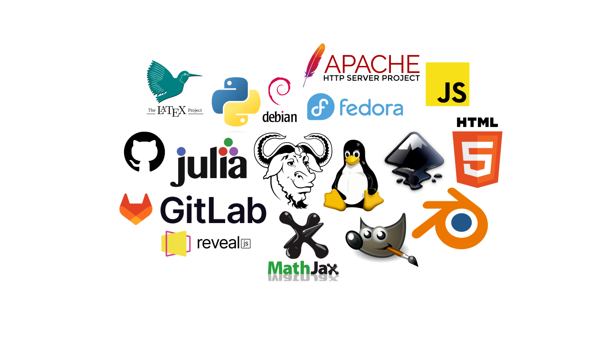

# The Open-Source Club 

Want to learn the tools used by professionals to create and maintain online content? This class gets you hands-on with HTML, Python, and more! Master Linux, Git version control, and dive into open-source publishing tools. Set up and maintain your own online sites, blogs, and public repositories. Collaborate with developers worldwide, build your online portfolio, and gain a serious edge for university and tech careers. Make your mark on the digital world - join us! Plus, you’ll get practical experience maintaining our school’s project repository, helping keep all the amazing student work organized and accessible! 

Wëllst du déi modernst Technologie léieren, déi vu Professionellen benotzt gëtt? An dësem Cours léiers du HTML, Python a nach an aner Sproochen ze codéieren! Du léiers den Ëmgang mat Linux, Git Versiounskontroll, an du kanns souguer fir richteg Open Source Projeten bäidroen. Du kollaboréiers mat Entwéckler weltwäit an du baus däin Programméierungsportfolio op. Du kriss och praktesch Erfarung fir eise Schoulprojet-Repository z'erhalen. 

## Source

- [Wikimedia Commons: Julia Programming Language Logo](https://commons.wikimedia.org/wiki/File:Julia_Programming_Language_Logo.svg)
- [Wikipedia: Debian Open Logo](https://en.wikipedia.org/wiki/Debian#/media/File:Debian-OpenLogo.svg)
- [Wikimedia Commons: The GNU Logo](https://commons.wikimedia.org/wiki/File:The_GNU_logo.png)
- [Wikipedia: Blender Logo](https://en.m.wikipedia.org/wiki/File:Blender_logo_no_text.svg)
- [Wikipedia: The GIMP icon](https://en.wikipedia.org/wiki/GIMP#/media/File:The_GIMP_icon_-_gnome.svg)
- [Wikipedia: HTML5 Logo](https://en.wikipedia.org/wiki/HTML#/media/File:HTML5_logo_and_wordmark.svg)
- [Wikipedia: MathJax Logo](https://en.wikipedia.org/wiki/MathJax#/media/File:MathJax.svg)
- [Wikipedia: Unofficial JavaScript Logo](https://simple.wikipedia.org/wiki/JavaScript#/media/File:Unofficial_JavaScript_logo_2.svg)
- [Wikipedia: Inkscape Logo](https://en.wikipedia.org/wiki/Inkscape#/media/File:Inkscape_Logo.svg)
- [Wikimedia Commons: Julia Programming Language Logo]()
- [Wikipedia: Apache HTTP server logo](https://en.wikipedia.org/wiki/Apache_HTTP_Server#/media/File:Apache_HTTP_server_logo_(2019-present).svg)
- [Wikipedia: Linux Tux](https://en.wikipedia.org/wiki/Linux#/media/File:Tux.svg)
- [Wikipedia: GitLab Logo](https://fr.wikipedia.org/wiki/GitLab#/media/Fichier:GitLab_logo_(2).svg)
- [Wikipedia: GitHub Invertocat Logo](https://en.wikipedia.org/wiki/GitHub#/media/File:GitHub_Invertocat_Logo.svg)
- [The LaTeX Project: LaTeX Project Logo](https://www.latex-project.org/about/logos/latex-project-logo_288x288.svg)
- [Wikimedia Commons: Raspberry Pi OS Logo](https://commons.wikimedia.org/wiki/File:Raspberry_Pi_OS_Logo.png)
- [Wikimedia Commons: Python Logo](https://commons.wikimedia.org/wiki/File:Python-logo.png)

