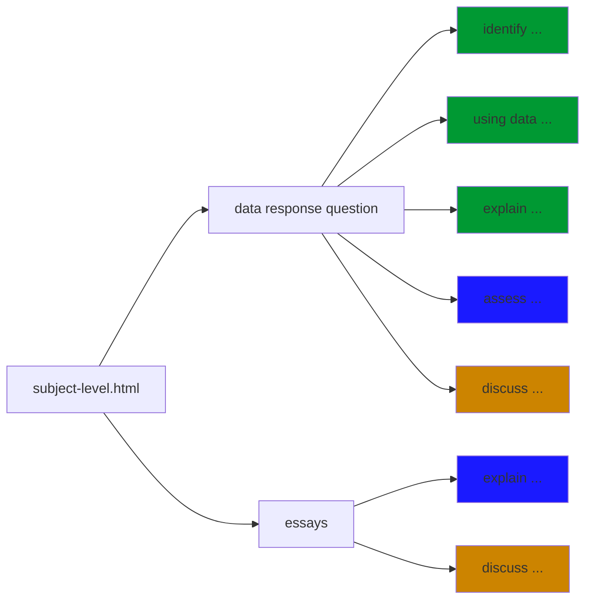
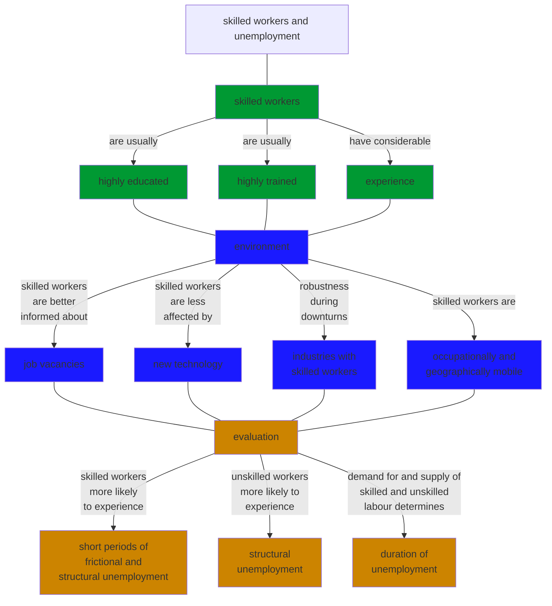
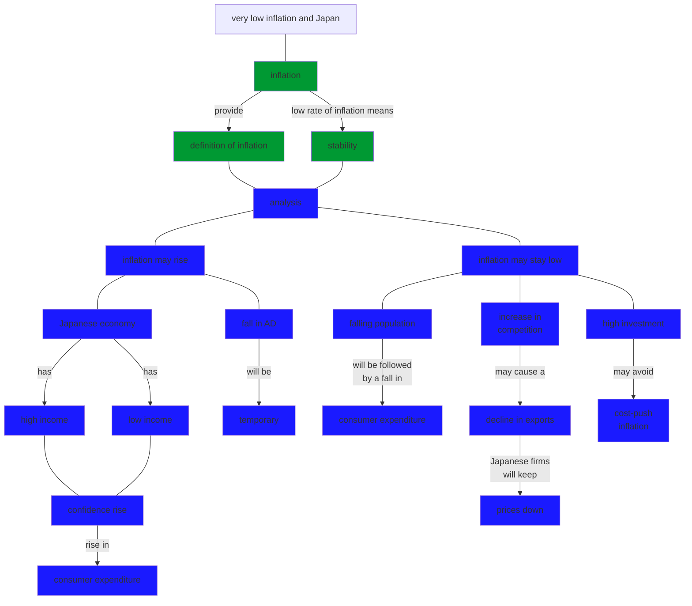
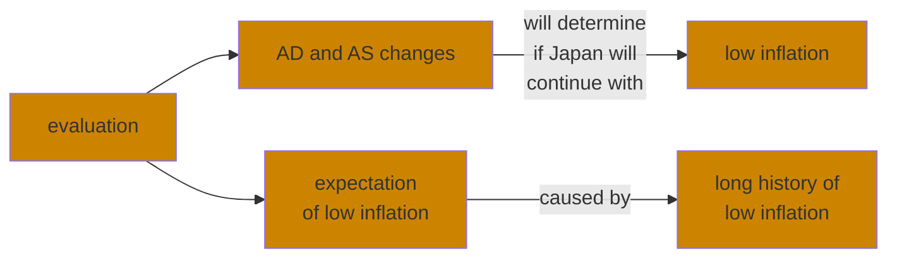
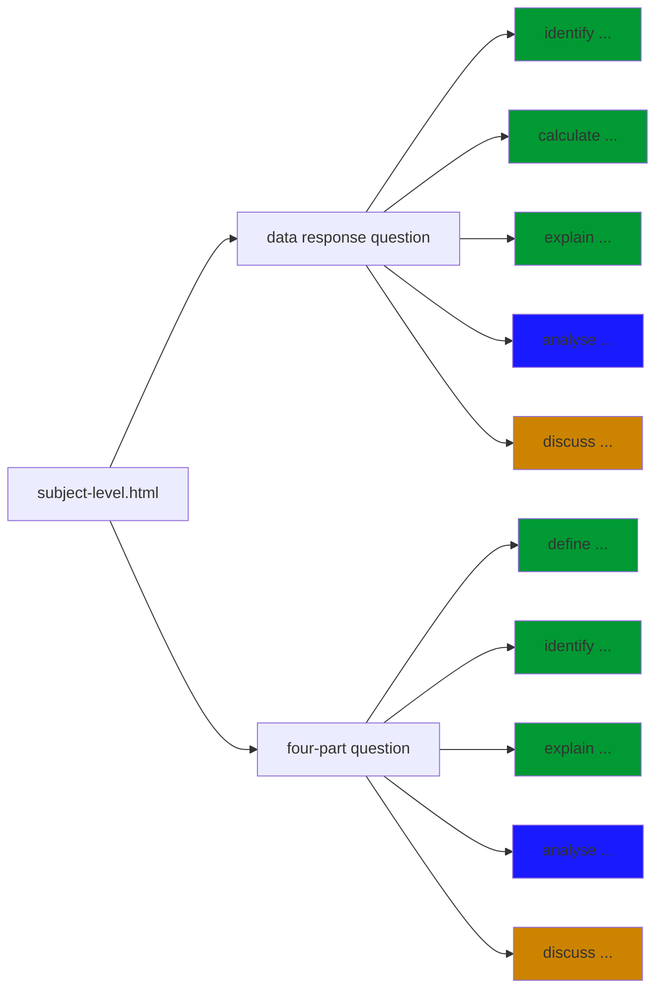

# 2iec econ

## Data response questions

### The challenges facing Japan 

```mermaid
graph LR;
    A[subject-level.html] 
    A --> A3[data response question]
    A --> A4[essays]

    A3 --> A31[identify ...]
    A3 --> A32[using data ...]
    A3 --> A33[explain ...]
    A3 --> A34[assess ...]
    A3 --> A35[discuss ...]

    A4 --> A43[explain ...]
    A4 --> A45[discuss ...]

    style A31 fill:#009933
    style A32 fill:#009933
    style A33 fill:#009933

    style A34 fill:#1A1AFF

    style A35 fill:#CC8400

    style A43 fill:#1A1AFF    

    style A45 fill:#CC8400    
```

#### Assess ....

```mermaid
graph TD;
    A[skilled workers and unemployment] 
    A --- B[skilled workers]
    B  -- are usually --> B1[highly educated]
    B  -- are usually --> B2[highly trained]
    B  -- have considerable --> B3[experience]
    B1 --- C[environment]
    B2 --- C
    B3 --- C
    C -- skilled workers <br> are better <br> informed about --> D1[job vacancies]
    C -- skilled workers <br> are less <br> affected by --> D2[new technology]
    C -- robustness <br> during <br> downturns --> D3[industries with <br> skilled workers]   
    C -- skilled workers are --> D4[occupationally and <br> geographically mobile]
    D1 --- E[evaluation]
    D2 --- E
    D3 --- E
    D4 --- E
    E -- skilled workers <br> more likely <br> to experience --> F1[short periods of <br> frictional and <br> structural unemployment]
    E -- unskilled workers <br> more likely to <br> experience --> F2[structural <br> unemployment] 
    E -- demand for and supply of <br> skilled and unskilled <br> labour determines --> F3[duration of <br> unemployment]

    style B fill:#009933
    style B1 fill:#009933
    style B2 fill:#009933 
    style B3 fill:#009933       

    style C fill:#1A1AFF   
    style D1 fill:#1A1AFF  
    style D2 fill:#1A1AFF  
    style D3 fill:#1A1AFF     
    style D4 fill:#1A1AFF  

    style E fill:#CC8400 
    style F1 fill:#CC8400 
    style F2 fill:#CC8400 
    style F3 fill:#CC8400 
```

#### Discuss ...

```mermaid
graph TD;
    A[very low inflation and Japan] 
    A --- B[inflation]
    B -- provide --> B1[definition of inflation]
    B -- low rate of inflation means --> B2[stability]
    B1 --- C[analysis]
    B2 --- C
    C --- C1[inflation may rise]
    C --- C2[inflation may stay low]

    C1 --- C11[Japanese economy]
    C11 -- has --> C111[high income]
    C11 -- has --> C112[low income]
    C111 --- C11a[confidence rise]
    C112 --- C11a
    C11a -- rise in --> C11b[consumer expenditure]

    C1 --- C12[fall in AD]
    C12 -- will be --> C121[temporary]

    C2 --- C21[falling population]
    C21 -- will be followed <br> by a fall in --> C21a[consumer expenditure] 

    C2 --- C22[increase in <br> competition]
    C22 -- may cause a --> C221[decline in exports]
    C221 -- Japanese firms <br> will keep --> C222[prices down]

    C2 --- C23[high investment]
    C23 -- may avoid --> C231[cost-push <br> inflation]

    style B fill:#009933
    style B1 fill:#009933    
    style B2 fill:#009933

    style C fill:#1A1AFF
    style C1 fill:#1A1AFF
    style C11 fill:#1A1AFF
    style C111 fill:#1A1AFF
    style C112 fill:#1A1AFF
    style C11a fill:#1A1AFF 
    style C11b fill:#1A1AFF      
    style C12 fill:#1A1AFF          
    style C121 fill:#1A1AFF              
    style C2 fill:#1A1AFF        
    style C21 fill:#1A1AFF
    style C21a fill:#1A1AFF
    style C22 fill:#1A1AFF
    style C221 fill:#1A1AFF
    style C222 fill:#1A1AFF
    style C23 fill:#1A1AFF 
    style C231 fill:#1A1AFF                       
```

 

 

```mermaid
graph LR;
    A[evaluation] 

    A --> A1[AD and AS changes]
    A1 -- will determine <br> if Japan will <br> continue with --> A1a[low inflation] 

    A --> A2[expectation <br> of low inflation]
    A2 -- caused by --> A21[long history of <br> low inflation]

    style A fill:#CC8400

    style A1 fill:#CC8400 
    style A1a fill:#CC8400 

    style A2 fill:#CC8400
    style A21 fill:#CC8400     
```

## Templates

```mermaid
graph LR;
    A[subject-level.html] 
    A --> A3[data response question]
    A --> A4[four-part question]

    A3 --> A31[identify ...]
    A3 --> A32[calculate ...]
    A3 --> A33[explain ...]
    A3 --> A34[analyse ...]
    A3 --> A35[discuss ...]

    A4 --> A41[define ...]
    A4 --> A42[identify ...]
    A4 --> A43[explain ...]
    A4 --> A44[analyse ...]
    A4 --> A45[discuss ...]

    style A31 fill:#009933
    style A32 fill:#009933
    style A33 fill:#009933

    style A34 fill:#1A1AFF

    style A35 fill:#CC8400

    style A41 fill:#009933
    style A42 fill:#009933
    style A43 fill:#009933    

    style A44 fill:#1A1AFF

    style A45 fill:#CC8400    
```