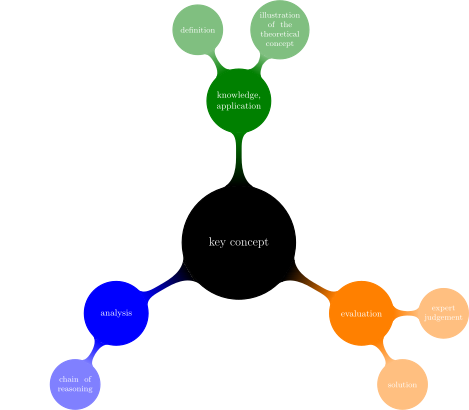
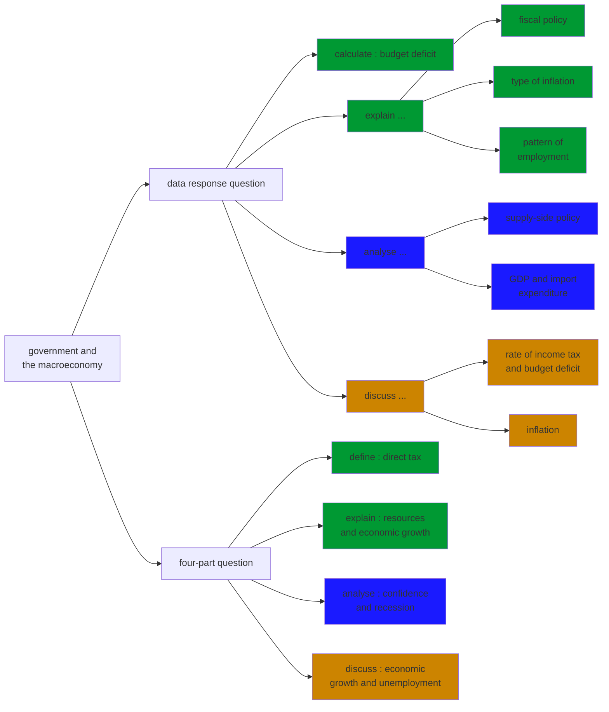
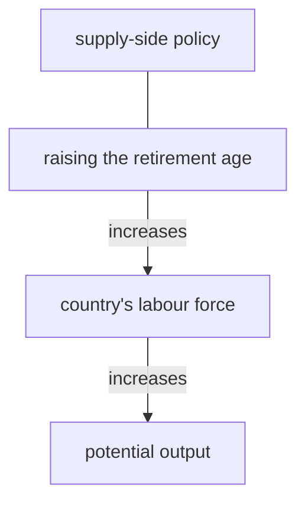
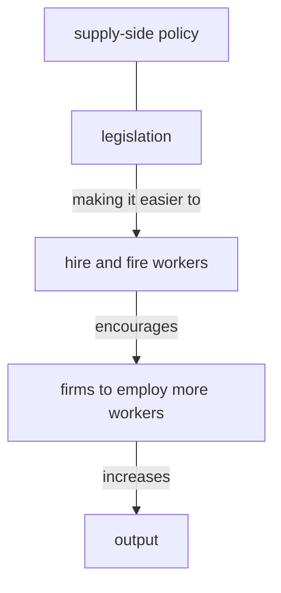
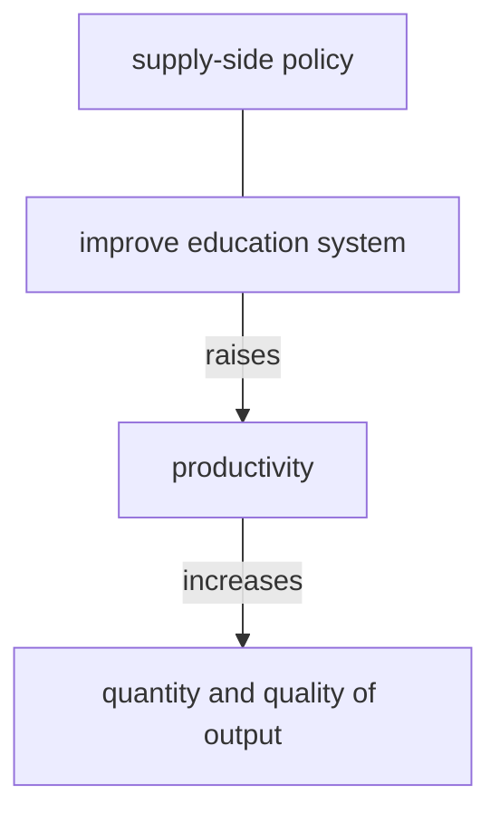
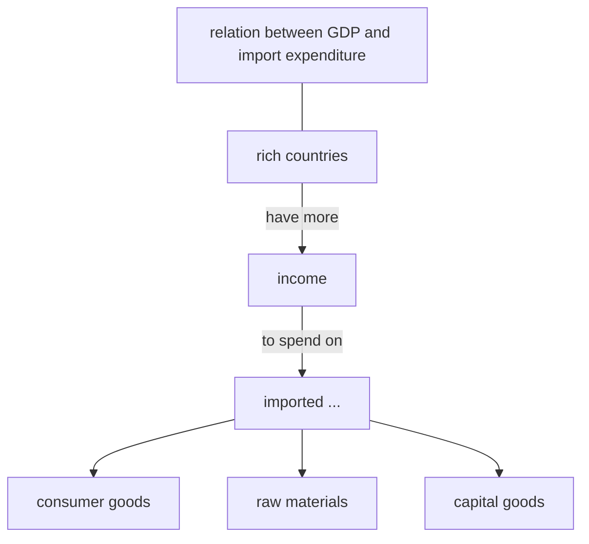
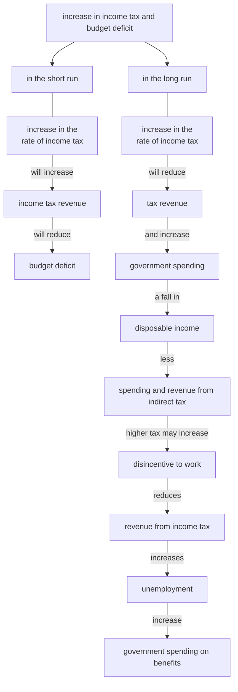
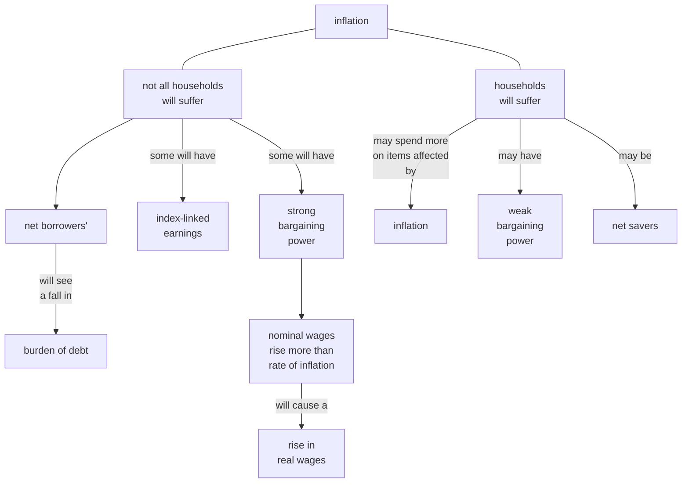
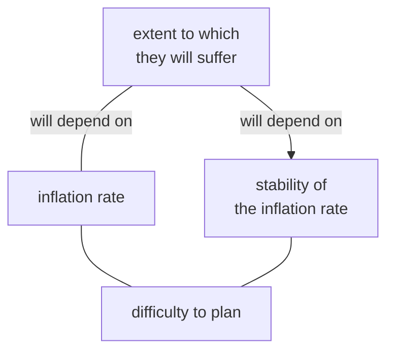
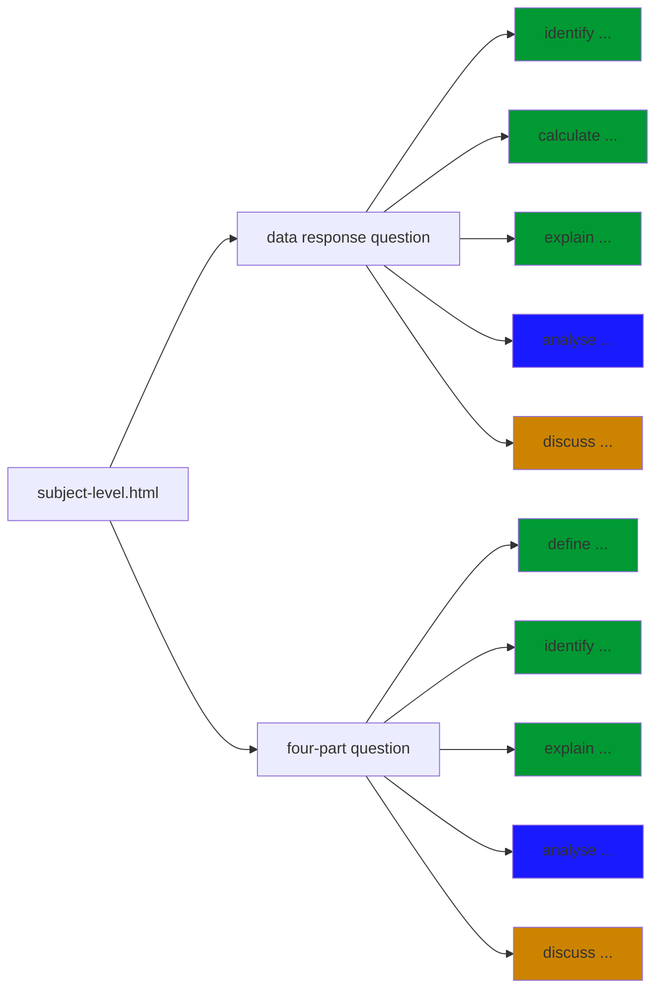

# 3iec econ

## Data response questions

### *The Bazilian government seeks to reform the economy* and *The Greek economy* 

#### Analyse ....

 

 

 

 

 

#### Analyse ...

#### Discuss ...

#### Discuss ...

 

 

## Templates

