# Comptabilité générale

 

 

 

## Terminologie

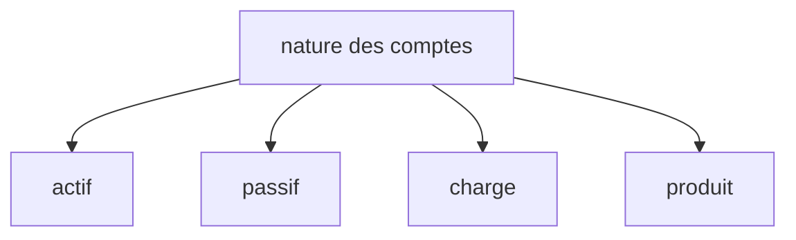

 

 

 

## Comptes de bilan et comptes de gestion

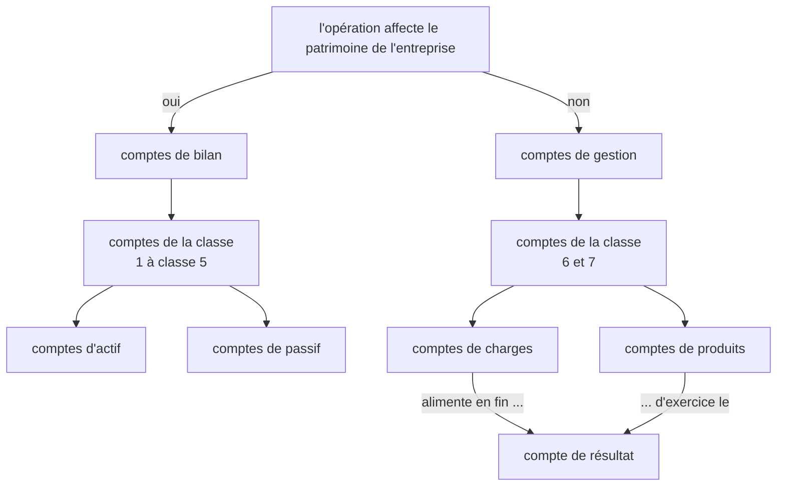
 

 

 

## Résumer les comptes en fin d'exercice

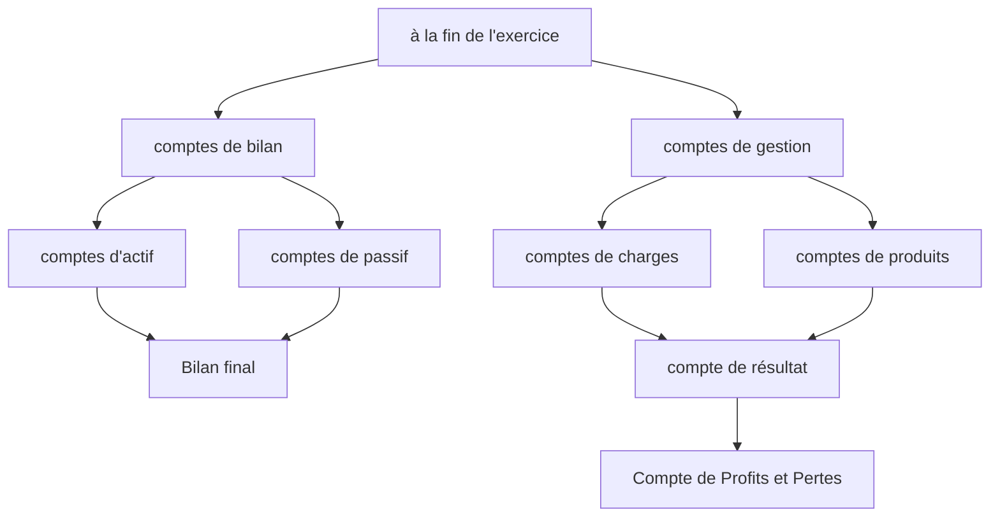

*Plan comptable normalisé luxembourgeois (Comptes de bilan)*
*Plan comptable normalisé luxembourgeois (Comptes de gestion)*

 

 

 

## 4. Les comptes de charges et de produits

 

 

 

### 4.1. Charges et produit

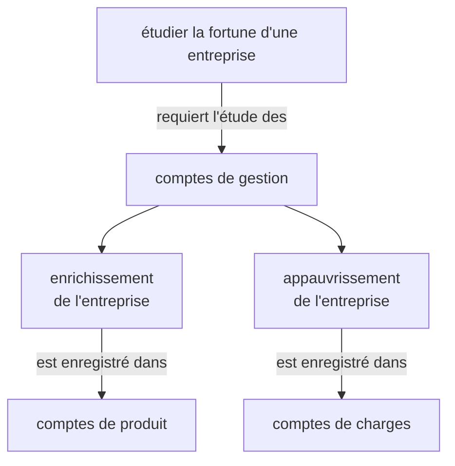
 

 

 

### 4.2. Bénéfice et perte de l'exercice 

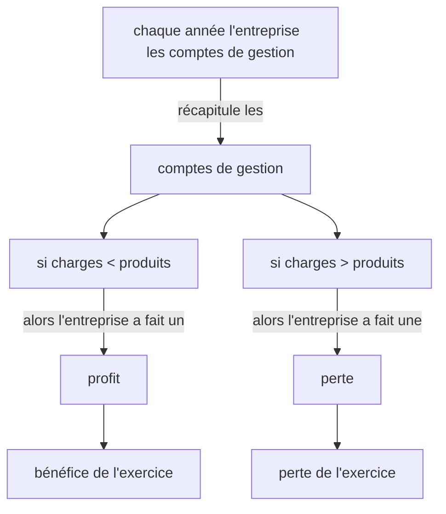
 

 

 

### 4.3. Compte de profits & pertes 

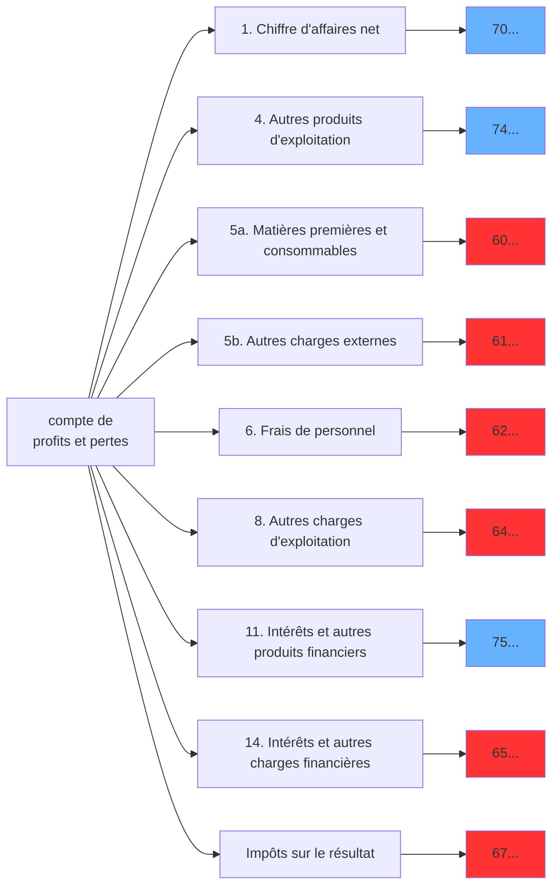

 

 

 

## 5. Le Journal

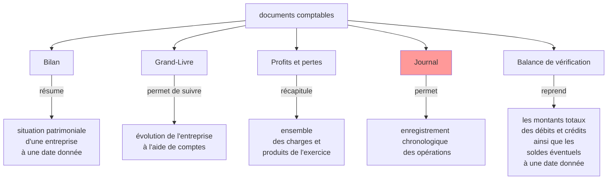

 

 

 

## 7. La TVA

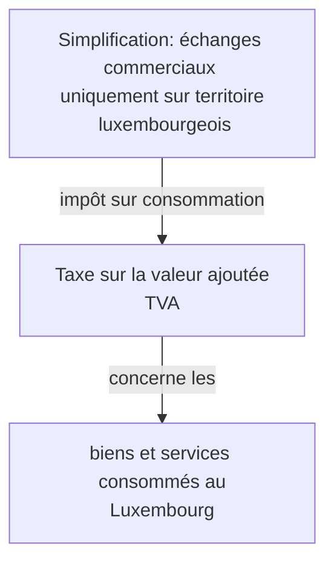

 

 

 

Perspective de l'entreprise ...

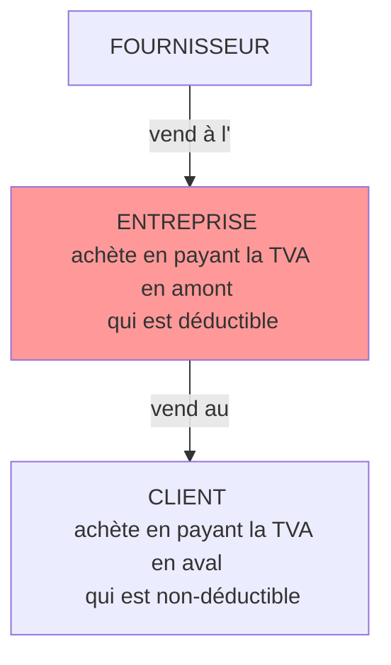

 

 

 

Les taux de TVA au Luxembourg ...

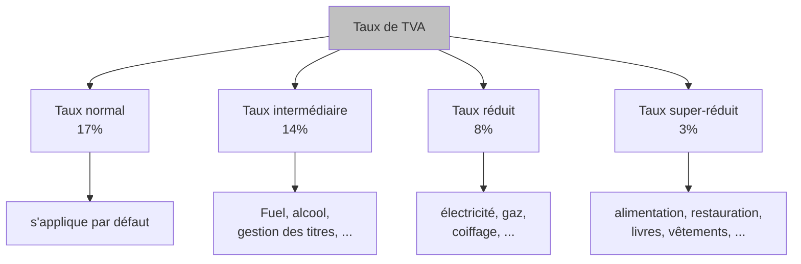

 

 

 

Calcul de la TVA ...

$HTVA + TVA = TTC$

$2.000 + 2.000 \cdot 0,17 = 2.340$ 

 

 

 

Comptabilisation de la TVA ...

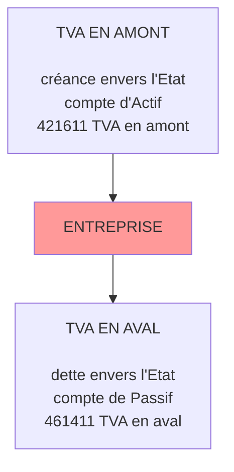

 

 

 

Formules de base ....

$HTVA + TVA = TTC$

$TTC = HTVA \times 1.17$
si la TVA est de 17%

$HTVA = TTC \div 1.17$
si la TVA est de 17%

 

 

 

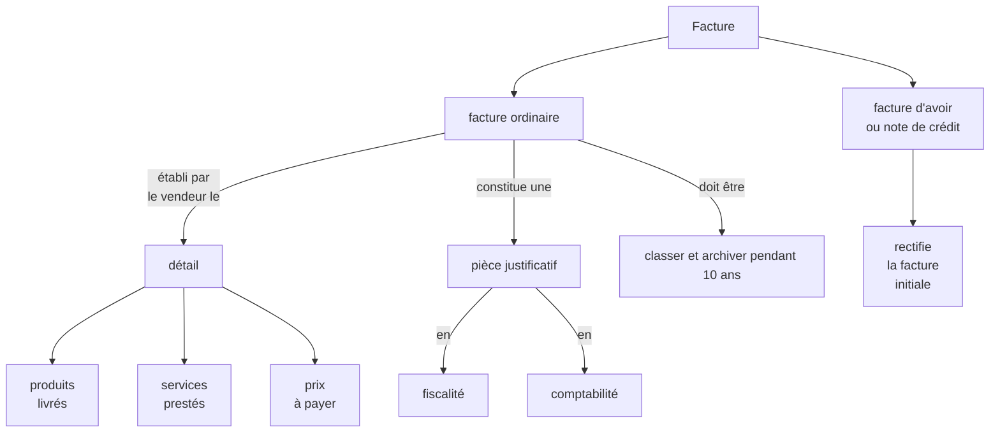

 

 

 

## 8. Les réductions de prix

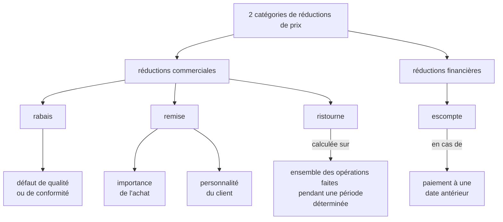

 

 

 

### Schéma de calcul

 

 

 

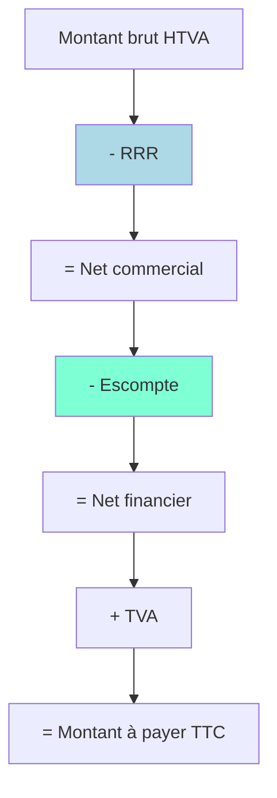

 

 

 

### Comptabilisation des réductions

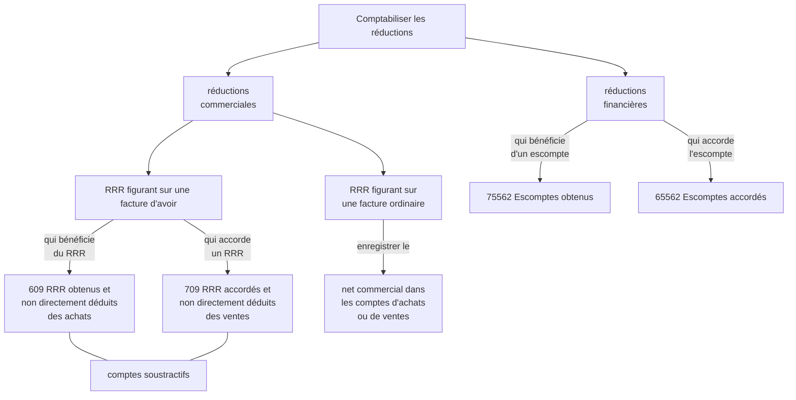

[La facturation et les réductions de prix (fiche de résumé)](../pdf/facturation-et-reductions-de-prix.pdf)